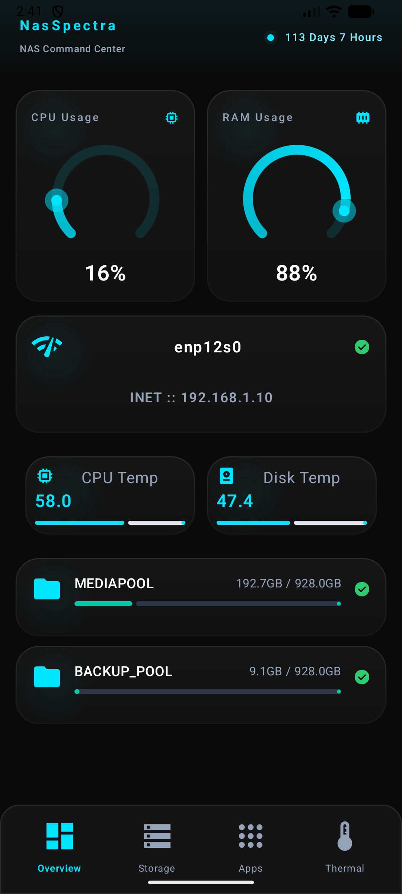
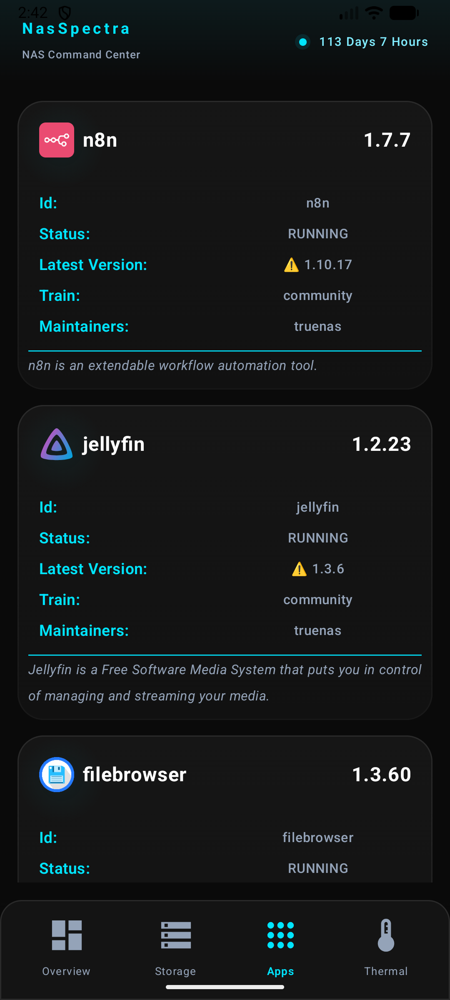
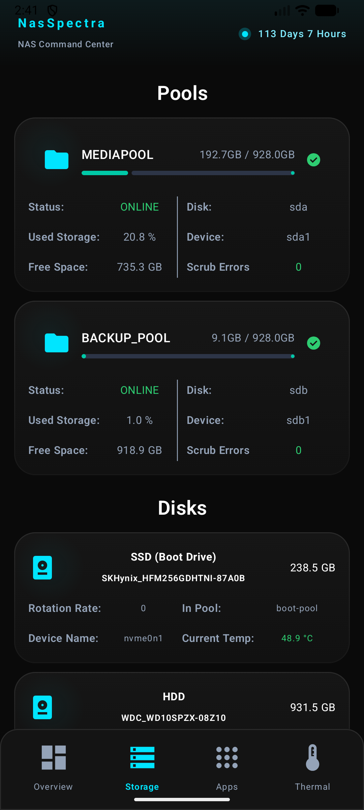

# NasSpectra 🚀

<p align="center">
  
  
  
  
</p>

NasSpectra is a professional, high-performance Android application designed specifically for monitoring and managing **TrueNAS** system statistics. It offers a sleek, intuitive dashboard that provides real-time insights into your NAS infrastructure's health and performance.

---

## 📱 Screenshots

<div align="center">
  <table>
    <tr>
      <td align="center"><b>Dashboard</b></td>
      <td align="center"><b>App Management</b></td>
      <td align="center"><b>Storage Management</b></td>
    </tr>
    <tr>
      <td></td>
      <td></td>
      <td></td>
    </tr>
  </table>
</div>

---

## ✨ Key Features

- 📊 **System Monitoring**: Track real-time CPU usage and RAM utilization with high-precision gauge components.
- 🌐 **Network Insights**: Monitor network interface states, link speeds, and IP configurations at a glance.
- 📂 **Storage Health**: Comprehensive overview of ZFS pools, including health status, allocated space, and total capacity.
- 🌡️ **Thermal Analytics**: Real-time monitoring of CPU and Disk temperatures with smart visual alerts for critical thresholds.
- 📦 **App Ecosystem**: Manage and track installed TrueNAS applications, versions, and available updates.
- 🛡️ **Robust Architecture**: Built with error-resilient mapping and automatic retry logic for unstable network conditions.

---

## 🏗️ Architecture & Design

The project is architected using **Clean Architecture** principles combined with **MVVM (Model-View-ViewModel)**, ensuring a separation of concerns that makes the codebase scalable and easy to test.

### 📐 Layered Structure
- **Presentation Layer**: Built with **Jetpack Compose**, utilizing unidirectional data flow (UDF) for a predictable and reactive UI state.
- **Domain Layer**: The heart of the application. Contains pure Kotlin business logic, including `UseCases`, domain `Models`, and `Repository` interfaces.
- **Data Layer**: Handles all data operations. Implements repository interfaces by orchestrating data from the TrueNAS REST API via **Retrofit**.

---

## 🛠️ Tech Stack

- **Core**: [Kotlin](https://kotlinlang.org/) + [Coroutines](https://kotlinlang.org/docs/coroutines-overview.html) & [Flow](https://kotlinlang.org/docs/flow.html)
- **UI Framework**: [Jetpack Compose](https://developer.android.com/jetpack/compose)
- **Dependency Injection**: [Hilt](https://developer.android.com/training/dependency-injection/hilt-android) (Dagger)
- **Networking**: [Retrofit](https://square.github.io/retrofit/) & [OkHttp](https://square.github.io/okhttp/)
- **Image Loading**: [Coil](https://coil-kt.github.io/coil/)
- **Architecture**: ViewModel, Lifecycle, Navigation Compose
- **Design System**: Material Design 3 (M3)

---

## 🚀 Getting Started

1. **Clone the Repo**
   ```bash
   git clone https://github.com/AyushTheHalotech/NasSpectra.git
   ```
2. **Open in Android Studio**
   Open the root project folder in the latest stable version of Android Studio.
3. **Configure API**
   Ensure your TrueNAS API credentials/endpoint are correctly configured in the data source.
4. **Build & Run**
   Sync Gradle and deploy the `:app` module to your device or emulator.

---

## 📂 Project Navigation

```text
com.thehalotech.nasspectra
├── application      # Hilt Application class and global DI Modules
├── core             # Shared components: UI themes, design system, and network core
└── feature_dashboard
    ├── data         # API definitions, DTOs, and Repository implementations
    ├── domain       # Business logic: UseCases and Domain Models
    └── presentation # UI: ViewModels, Screens, and Compose Components
```

---

<p align="center">
  <i>Developed with ❤️ by <b>TheHaloTech</b></i>
</p>
